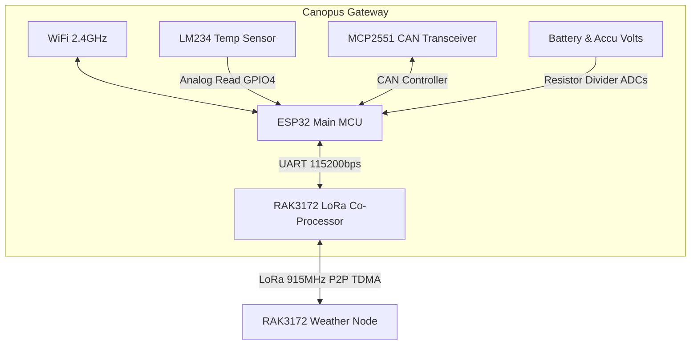
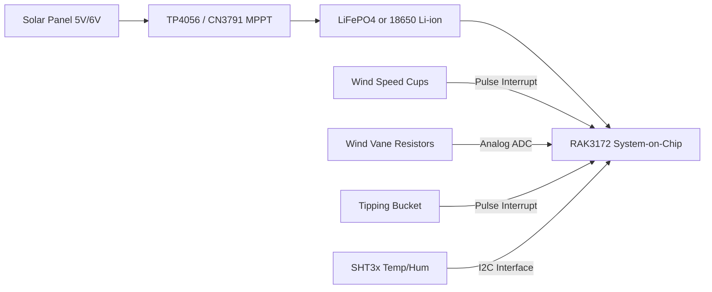

# Hardware Architecture & Design: ArduLoFi Canopus LoRa Gateway & Weather Station Node

**Project Title**: ArduLoFi Canopus: Industrial-Grade ESP32 LoRa Gateway with Animated Telemetry Dashboard  
**Subtitle**: An open-source, collision-free LoRa TDMA telemetry system designed for Wi-Fi-enabled gateways and self-powered outdoor weather nodes.

---

## 1. Executive Hardware Overview

Many maker-grade IoT installations fail in the field due to two major bottlenecks: **packet collisions** under high-density node environments and **heap fragmentation** in gateway firmware running on dynamic strings. 

**ArduLoFi Canopus** solves these issues through a hardware-software co-design:
1. **Canopus Gateway (ESP32 + RAK3172)**: An industrial-grade base station featuring built-in Wi-Fi connectivity for network backhaul (MQTT and local web server hosting) paired with a dedicated LoRa co-processor running a custom TDMA scheduler.
2. **Telemetry / Weather Node (RAK3172 standalone)**: An ultra-low-power, solar-harvesting outdoor station incorporating off-the-shelf physical weather sensors (cup anemometer, wind vane, rain gauge, Stevenson louver screen) communicating via precise time slots to eliminate radio collisions.

---

## 2. Gateway Hardware Architecture

The Gateway splits responsibilities between a dual-core **ESP32-WROOM-32E** (handling Wi-Fi networking, WebSockets, REST HTTP server, and local sensors) and a **RAK3172 module** (acting as a dedicated LoRa RF frontend and time-slot controller).



### 2.1. Wi-Fi Connectivity & Network Services
The Gateway connects to the internet or local intranet via the ESP32's built-in 2.4GHz Wi-Fi:
* **AP and Station Modes**: Supports connection to standard local Wi-Fi networks (via WiFiMulti credentials) while running a local SoftAP hotspot fallback for configuration.
* **REST & WebSockets Server**: Serves a dynamic glassmorphic telemetry dashboard directly from its flash memory, providing low-latency browser updates.
* **MQTT Client**: Connects to an external MQTT broker (e.g., HiveMQ, EMQX) to publish node telemetry and diagnostics.

### 2.2. Dedicated LoRa Co-Processor (RAK3172)
To offload RF timings and packet handling from the FreeRTOS network and web tasks, a **RAK3172 module** (STM32WLE5CC SoC) is interfaced via hardware serial:
* **ESP32 RX / TX**: GPIO16 and GPIO17 connected to RAK3172 UART interface.
* **Co-Processor Duty**: It executes a microsecond-accurate state machine that transmits a synchronization beacon (`*SYNC_START`) and receives data packets from nodes in dedicated time slots.

### 2.3. On-Board Sensors & Industrial Interfaces
* **Local Temp Sensor**: An **LM234** current-source temperature sensor connected to an analog-read pin (GPIO4) and controlled/biased by GPIO5.
* **Power Monitoring**: Built-in resistor divider networks scale down external Accumulator (up to 24V) and Backup Battery (up to 4.2V) voltages to fit the ESP32's 3.3V ADC range (read via GPIO36 and GPIO39).
* **CAN-Bus Port**: Built-in **MCP2551** CAN transceiver enabled via GPIO15 (`ENABLE_VEXT`) for wired multi-node industrial communication.
* **Cellular Prep**: SIM card power control switch (`ENABLE_VSIM_PIN`) connected to GPIO13.

---

## 3. LoRa Weather Node Hardware Architecture

The remote telemetry node is designed to run autonomously in the field for years, utilizing solar energy harvesting and standard, commercially purchasable weather sensor hardware.



### 3.1. Physical Weather Sensors
The node utilizes standard spare parts widely available on the market (such as Fine Offset/Misol spare parts), making it easy to replicate or replace:
1. **Anemometer (Wind Speed)**: A magnetic reed-switch based cup anemometer. As the wind spins the 3 cups, a magnet passes a reed switch, generating 1 pulse per rotation (calibrated to wind velocity where $V = 2.4 \text{ km/h per Hz}$).
2. **Wind Vane (Wind Direction)**: A weather-proof vane housing an internal 8-reed-switch circular array connected to different resistor values (resistor ladder). When the magnet inside the vane points to a direction, it closes specific switches, forming a voltage divider that the RAK3172 reads via its 12-bit ADC.
3. **Rain Gauge (Precipitation)**: A tipping-bucket style collector. Rain enters a funnel and fills a small double-sided bucket. When 0.279mm of rain accumulates, the bucket tips, passing a magnet over a reed switch to generate a single clean pulse.
4. **Solar Radiation Shield (Stevenson Screen)**: The SHT30/31 air temperature and humidity sensor is housed inside a white multi-plate UV-stabilized plastic louver shield. This structure blocks direct sunlight and rain while allowing ambient air to flow freely, preventing temperature spikes due to solar radiation.

### 3.2. Solar Power & Energy Harvesting
Outdoor node survival relies on high efficiency and low sleep currents:
* **Storage**: A single 3.2V LiFePO4 battery (chosen for thermal stability up to 60°C in outdoor enclosures) or a standard 3.7V 18650 Li-ion battery.
* **Charger**: A **CN3791** solar tracking charger or a **TP4056** with built-in battery protection.
* **Ultra-Low-Power MCU**: The **RAK3172** is built on the STM32WLE5CC chip, utilizing an Arm Cortex-M4 core. In deep sleep mode (between slot cycles), the transceiver draws less than **2µA**, allowing it to run indefinitely on a tiny 2W solar panel.

---

## 4. Time-Division Multiple Access (TDMA) Hardware Timing

Standard LoRa network architectures (like LoRaWAN Class A) use ALOHA-based media access, which suffers from packet collisions when many nodes transmit simultaneously. Canopus uses a custom TDMA protocol to coordinate precise transmission times.

```
Timeline (Cycle = SYNC_SLOT + N * SLOT_MS + DISCOVERY_MS)
|=== SYNC_START ===|=== SLOT 1 ===|=== SLOT 2 ===| ... |=== DISCOVERY ===|
|  Gateway Beacon  |  Node 1 Tx   |  Node 2 Tx   |     |  New Nodes Join |
|  (Time Anchor)   |  (Data+Ack)  |  (Data+Ack)  |     |  (ALOHA Mode)   |
```

### 4.1. Hardware Synchronization & Drift Correction
Because node microcontrollers use internal crystal oscillators or RC circuits that drift with ambient temperature, nodes calculate their time offset relative to the Gateway's sync beacon:
1. **Beacon Anchor**: The Gateway broadcasts a high-priority `*SYNC_START` frame at the beginning of each cycle.
2. **Time-Sync calculation**: The node records the hardware arrival time of the beacon. It schedules its transmission slot at:
   $$\text{TxTime} = \text{BeaconArrivalTime} + (\text{NodeID} \times \text{SlotDuration})$$
3. **Drift Measurement**: The Gateway measures the arrival time of each node's packet compared to its ideal slot window. It calculates the drift in milliseconds.
4. **Advisory Feedback (ADV)**: In the immediate acknowledgement packet (`*GW_ACK`), the Gateway sends an advisory value (from 1 to 15, where 8 is perfect):
   * **ADV < 8**: Node packet arrived early. Gateway advises the node to wake up slightly later in the next cycle.
   * **ADV > 8**: Node packet arrived late. Gateway advises the node to wake up slightly earlier.

This closed-loop feedback loop keeps all nodes synchronized to within **±5ms** of their assigned slots, eliminating collision risks completely.

---

## 5. Wiring & Pin Configuration Tables

### 5.1. Canopus Gateway ESP32 Pin Connections

| ESP32 Pin | Function | Description | Connection |
| :--- | :--- | :--- | :--- |
| **GPIO16** | `RX2` | Hardware Serial 2 RX | RAK3172 TX |
| **GPIO17** | `TX2` | Hardware Serial 2 TX | RAK3172 RX |
| **GPIO4** | `LM234_READ` | Analog read of temperature | LM234 Sensor Pin |
| **GPIO5** | `LM234_BIAS` | Control current bias | LM234 Supply Pin |
| **GPIO36**| `ACCU_READ` | Accumulator voltage read | Resistor Divider (24V Max) |
| **GPIO39**| `BATT_READ` | Battery voltage read | Resistor Divider (4.2V Max) |
| **GPIO12**| `LED_RUN` | Status indicator LED | Red Running LED |
| **GPIO34**| `SETTING_BT`| Configure Mode Trigger | Physical Button to GND |
| **GPIO15**| `ENABLE_VEXT`| 3.3V CAN/Aux Bus Enable | MCP2551 Transceiver Enable |
| **GPIO13**| `ENABLE_VSIM`| Cellular Modem Power Switch | SIM Power MOS Gate |

### 5.2. RAK3172 (STM32WLE5) Pin Connections

| RAK3172 Pin | Function | Description | Connection |
| :--- | :--- | :--- | :--- |
| **PA9** | `UART2_TX` | Command Serial Interface | ESP32 RX (GPIO16) |
| **PA10**| `UART2_RX` | Command Serial Interface | ESP32 TX (GPIO17) |
| **PA8** | `LED_RX` | RF Packet Receive indicator | Blue LED |
| **PA9** | `LED_TX` | RF Packet Send indicator | Green LED |
| **PA15**| `LED_RUN` | Main Heartbeat LED | Yellow LED |
| **PA1** | `LED_SYNC` | Beacon Synchronization LED | Orange LED |
| **PB3** | `ANALOG_IN` | Analog Sensor Port | Tipping Bucket or Water sensor input |

---

## 6. How to Build & Assemble

1. **PCB Fabrication**: Layout a dual-layer PCB matching the ESP32 pinouts and routing serial communication lines.
2. **LoRa Setup**: Flash the RAK3172 modules using a USB-to-UART converter. Compile the [RAK3172.ino](file:///d:/Github/ArduLoFi/examples/ArduLoFi_Canopus/RAK3172/RAK3172.ino) firmware using the STM32 RUI3 board manager.
3. **ESP32 Setup**: Compile and flash [ESP32.ino](file:///d:/Github/ArduLoFi/examples/ArduLoFi_Canopus/ESP32/ESP32.ino) to the main controller. Ensure the config file [config.h](file:///d:/Github/ArduLoFi/examples/ArduLoFi_Canopus/ESP32/config.h) has correct Wi-Fi and MQTT credentials.
4. **Deploy Node**: Fit the SHT3x sensor in the Stevenson screen, mount the wind speed/direction sensors on your pole mast, and connect their terminals to the RAK3172 node inputs.
